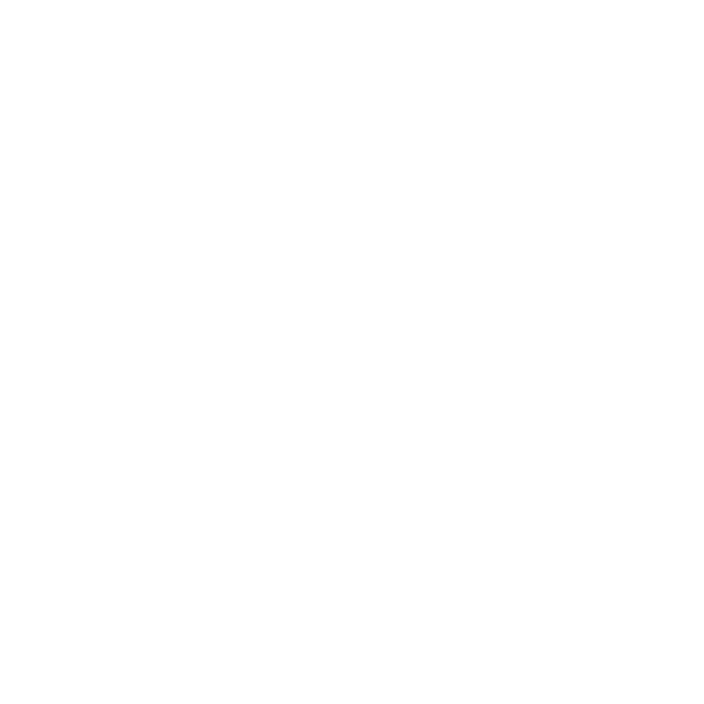
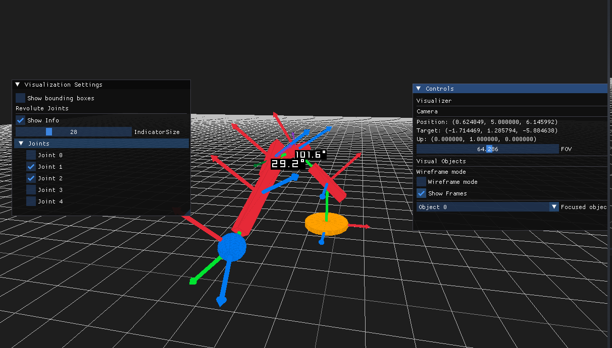
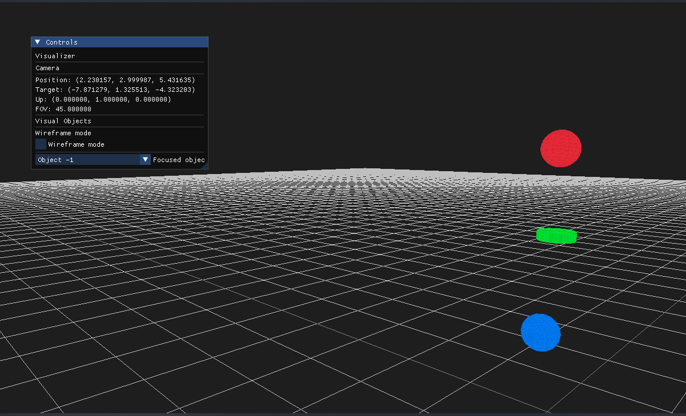

<p align="center">
  
</p>


<p align="center">
  <a href="https://opensource.org/licenses/MIT"></a>
  <a href="https://GitHub.com/eduardo98m/RoboSim/issues/"></a>
  <a href="https://GitHub.com/eduardo98m/RoboSim/pulls/"></a>
</p>

# RoboSim

RoboSim (ROBOtics + SIMulator) is a projects that aims to create an easy to use and easy to customize rigid body physics simulator for robotics applications. The project is currently under early development.



## Current State of the Simulator

You can see the current state of the simulator in the following video:

[](http://www.youtube.com/watch?v=cLKrVKXZ3UE "RoboSim Demo")


## Installation

**Note:** These instructions have been tested on Linux, but there should be no problems following them on Windows (or Mac) as well.

### Prerequisites

Before you begin, ensure you have met the following requirements:

* You have installed the latest version of [raylib](https://www.raylib.com/) and [CMake](https://cmake.org/).

For the collision detection and response we decided it was a better option to use an already available package (I could not take the burden of programming all of the collisions)

* hpp-fcl (Human path planner fast collision library) : (We use the 2.4.4 version)
    * For linux : 
```bash
    mkdir build
    cd build
    cmake .. -DBUILD_PYTHON_INTERFACE=OFF
    make
    sudo make install
```

* octomap : (We use the 1.9.6 version)
```bash
    mkdir build
    cd build
    cmake .. 
    make
    sudo make install
```

* You also need eigen :
```bash
sudo apt install libeigen3-dev
```
    
### Installing RoboSim

To install RoboSim, follow these steps:

1. Clone this repository recursively:

```bash
git clone --recursive https://github.com/your_username/RoboSim.git
```

2. Navigate to the cloned repository:

```bash
cd RoboSim
```
3. Use CMake to build the project :

```bash
mkdir build
cd build
cmake ..
make
```

# TODO:
* [ ] Build intructions/Tutorial
* [ ] Documentation
* [-] Interface Simulator <-> Visualizer (WIP)
* [ ] **Collisions**
    * [-] Add collision shapes
        * [x] Sphere
        * [x] Box
        * [x] Cylinder
        * [ ] Capsule
        * [x] Plane (There might be issues with the plane)
        * [ ] Heightmap
    * [x] Collision detection and respose implemeted using hpp::fcl (human path planner fast colision library).
    * [x] Collision groups.
* [ ] **Constraints**
    * [x] Contact constraints.
    * [ ] Prismatic joint constraint
        * [ ] Limited
        * [ ] Driven
        * [ ] Damped
    * [ ] Revolute joint constraint
        * [x] Limited
        * [x] Driven
            * [x] Position driven
            * [-] Speed driven (It is implemented but there are errors on the implementation: target speed doesnt match the actual speed). 
        * [x] Damped
    * [ ] Spherica joint
        * [ ] Limited
        * [ ] Damped
* [ ] URDF importer
* [ ] Paralelization with OpenMP

    
## Screenshots

